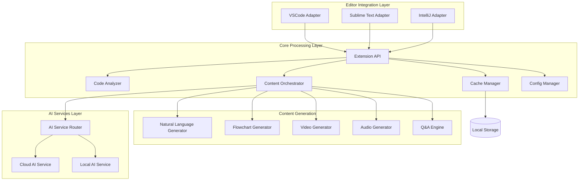

# Design Document: AI Code Explainer Extension

## Overview

The AI Code Explainer Extension is a cross-platform plugin that integrates with VSCode, Sublime Text, and IntelliJ IDE to provide AI-generated multimedia explanations of source code. The system uses a modular architecture with three main layers:

1. **Editor Integration Layer**: Platform-specific adapters for each supported editor
2. **Core Processing Layer**: Language-agnostic code analysis, AI orchestration, and content generation
3. **AI Services Layer**: Code analysis, natural language generation, flowchart creation, and Q&A processing

The extension supports both cloud-based and local AI processing modes to accommodate privacy requirements. Content is generated in video or audio format with variable length (2-10 minutes) based on code complexity, and includes flowcharts, cross-language examples, and interactive Q&A capabilities.

## Architecture

### High-Level Architecture



### Design Principles

1. **Platform Abstraction**: Editor-specific code is isolated in adapters, allowing the core logic to remain platform-agnostic
2. **Modular AI Services**: AI processing can be switched between cloud and local modes without affecting other components
3. **Progressive Enhancement**: Basic explanations work offline; advanced features require cloud connectivity
4. **Caching Strategy**: Generated content is cached with code fingerprinting to avoid redundant processing
5. **Privacy-First**: Users control whether code leaves their machine

## Components and Interfaces

### 1. Editor Integration Layer

#### VSCode Adapter
Implements VSCode Extension API to integrate with Visual Studio Code.

**Responsibilities:**
- Register extension commands and UI elements
- Access VSCode text editor API for code selection
- Display content in VSCode webview panels
- Handle VSCode-specific configuration

**Key Interfaces:**
```typescript
interface IEditorAdapter {
  initialize(): Promise<void>;
  getSelectedCode(): CodeSelection;
  getActiveFile(): FileInfo;
  getWorkspaceFiles(): FileInfo[];
  showExplanationPanel(content: ExplanationContent): void;
  showError(message: string): void;
  showProgress(message: string, progress: number): void;
}

interface CodeSelection {
  code: string;
  language: string;
  filePath: string;
  startLine: number;
  endLine: number;
}

interface FileInfo {
  path: string;
  language: string;
  size: number;
}
```

#### Sublime Text Adapter
Implements Sublime Text Plugin API.

**Responsibilities:**
- Register plugin commands
- Access Sublime Text view API for code selection
- Display content in output panels or external browser
- Handle Sublime-specific configuration

**Implements:** Same `IEditorAdapter` interface

#### IntelliJ Adapter
Implements IntelliJ Platform Plugin API.

**Responsibilities:**
- Register IntelliJ actions and tool windows
- Access IntelliJ PSI (Program Structure Interface) for code analysis
- Display content in IntelliJ tool windows
- Handle IntelliJ-specific configuration

**Implements:** Same `IEditorAdapter` interface

### 2. Core Processing Layer

#### Extension API
Central coordinator that receives requests from editor adapters and orchestrates the explanation generation process.

**Responsibilities:**
- Route requests to appropriate services
- Manage request lifecycle
- Coordinate between cache, config, and content generation
- Handle errors and provide user feedback

**Key Interfaces:**
```typescript
interface IExtensionAPI {
  generateExplanation(request: ExplanationRequest): Promise<ExplanationContent>;
  generateCodebaseOverview(workspacePath: string): Promise<CodebaseOverview>;
  startQASession(contentId: string): QASession;
  getCachedExplanations(): CachedExplanation[];
  clearCache(): void;
}

interface ExplanationRequest {
  code: string;
  language: string;
  targetLanguage: string;
  includeFlowchart: boolean;
  includeExamples: boolean;
  contentType: 'video' | 'audio';
}

interface ExplanationContent {
  id: string;
  contentUrl: string;
  contentType: 'video' | 'audio';
  duration: number;
  transcript: string;
  flowchart?: FlowchartData;
  examples?: CodeExample[];
  timestamp: Date;
}
```

#### Code Analyzer
Analyzes source code structure, complexity, and semantics to inform content generation.

**Responsibilities:**
- Parse code into AST (Abstract Syntax Tree)
- Identify code constructs (functions, classes, loops, conditionals)
- Calculate code complexity metrics
- Extract code dependencies and relationships
- Determine appropriate content length based on complexity

**Key Interfaces:**
```typescript
interface ICodeAnalyzer {
  analyze(code: string, language: string): CodeAnalysis;
  calculateComplexity(code: string, language: string): ComplexityMetrics;
  extractStructure(code: string, language: string): CodeStructure;
}

interface CodeAnalysis {
  language: string;
  lineCount: number;
  complexity: ComplexityMetrics;
  structure: CodeStructure;
  dependencies: string[];
  estimatedDuration: number; // in seconds
}

interface ComplexityMetrics {
  cyclomaticComplexity: number;
  cognitiveComplexity: number;
  nestingDepth: number;
}

interface CodeStructure {
  functions: FunctionInfo[];
  classes: ClassInfo[];
  imports: ImportInfo[];
  controlFlow: ControlFlowNode[];
}
```

#### Content Orchestrator
Coordinates the multi-step process of generating explanation content.

**Responsibilities:**
- Determine content generation strategy based on code analysis
- Coordinate AI services for explanation generation
- Assemble final content (video/audio with flowcharts and examples)
- Manage content generation pipeline
- Handle partial failures and retries

**Key Interfaces:**
```typescript
interface IContentOrchestrator {
  orchestrate(request: ExplanationRequest, analysis: CodeAnalysis): Promise<ExplanationContent>;
}

interface GenerationPipeline {
  generateScript(code: string, analysis: CodeAnalysis, targetLang: string): Promise<Script>;
  generateFlowchart(structure: CodeStructure): Promise<FlowchartData>;
  generateExamples(code: string, sourceLang: string): Promise<CodeExample[]>;
  synthesizeContent(script: Script, flowchart: FlowchartData, examples: CodeExample[], type: 'video' | 'audio'): Promise<string>;
}
```

#### Cache Manager
Manages local storage of generated explanations with code fingerprinting.

**Responsibilities:**
- Generate fingerprints (hashes) of code for cache keys
- Store and retrieve cached explanations
- Invalidate cache when code changes
- Manage cache size and eviction policies
- Provide cache statistics

**Key Interfaces:**
```typescript
interface ICacheManager {
  get(codeFingerprint: string): Promise<ExplanationContent | null>;
  set(codeFingerprint: string, content: ExplanationContent): Promise<void>;
  invalidate(codeFingerprint: string): Promise<void>;
  clear(): Promise<void>;
  list(): Promise<CachedExplanation[]>;
}

interface CachedExplanation {
  fingerprint: string;
  content: ExplanationContent;
  codeSnippet: string;
  createdAt: Date;
  accessCount: number;
}
```

#### Config Manager
Manages user preferences and extension configuration.

**Responsibilities:**
- Load and save user preferences
- Validate configuration values
- Provide default configuration
- Handle configuration changes
- Manage API keys and credentials securely

**Key Interfaces:**
```typescript
interface IConfigManager {
  get<T>(key: string): T;
  set<T>(key: string, value: T): void;
  getAll(): Configuration;
  reset(): void;
}

interface Configuration {
  defaultTargetLanguage: string;
  defaultContentType: 'video' | 'audio';
  aiMode: 'cloud' | 'local' | 'hybrid';
  includeFlowcharts: boolean;
  includeExamples: boolean;
  cacheEnabled: boolean;
  maxCacheSize: number; // in MB
  playbackSpeed: number;
  privacyMode: boolean;
}
```

### 3. AI Services Layer

#### AI Service Router
Routes AI requests to appropriate service (cloud or local) based on configuration and availability.

**Responsibilities:**
- Determine which AI service to use
- Handle fallback from cloud to local
- Load balance requests if multiple services available
- Monitor service health

**Key Interfaces:**
```typescript
interface IAIServiceRouter {
  route(request: AIRequest): Promise<IAIService>;
  getAvailableServices(): AIServiceInfo[];
}

interface IAIService {
  analyzeCode(code: string, language: string): Promise<CodeInsights>;
  generateExplanation(code: string, insights: CodeInsights, targetLang: string): Promise<string>;
  generateFlowchart(structure: CodeStructure): Promise<FlowchartData>;
  generateExamples(code: string, sourceLang: string, targetLangs: string[]): Promise<CodeExample[]>;
  answerQuestion(question: string, context: QAContext): Promise<string>;
}
```

#### Cloud AI Service
Interfaces with cloud-based AI models (e.g., OpenAI, Anthropic, Google AI).

**Responsibilities:**
- Send code and prompts to cloud AI APIs
- Handle API authentication and rate limiting
- Parse and validate AI responses
- Implement retry logic for transient failures
- Encrypt code before transmission

**Implements:** `IAIService` interface

#### Local AI Service
Runs AI models locally using frameworks like ONNX Runtime or llama.cpp.

**Responsibilities:**
- Load and initialize local AI models
- Process requests entirely on user's machine
- Manage model memory and compute resources
- Provide degraded but functional service for privacy mode

**Implements:** `IAIService` interface

### 4. Content Generation Components

#### Natural Language Generator
Converts code insights into natural language explanations.

**Responsibilities:**
- Generate explanation scripts in target language
- Structure explanations with introduction, body, and conclusion
- Create line-by-line explanations
- Generate file-level summaries for codebase overviews

**Key Interfaces:**
```typescript
interface INLGenerator {
  generateScript(insights: CodeInsights, targetLang: string): Promise<Script>;
  generateLineSummary(line: string, context: CodeContext, targetLang: string): Promise<string>;
}

interface Script {
  introduction: string;
  sections: ScriptSection[];
  conclusion: string;
  estimatedDuration: number;
}

interface ScriptSection {
  title: string;
  content: string;
  codeReference?: CodeReference;
  timestamp?: number;
}
```

#### Flowchart Generator
Creates visual flowcharts from code structure.

**Responsibilities:**
- Convert control flow to flowchart nodes and edges
- Generate flowchart in standard format (Mermaid, DOT)
- Render flowchart as image or SVG
- Annotate flowchart with explanations

**Key Interfaces:**
```typescript
interface IFlowchartGenerator {
  generate(structure: CodeStructure): Promise<FlowchartData>;
  render(flowchart: FlowchartData, format: 'svg' | 'png'): Promise<string>;
}

interface FlowchartData {
  nodes: FlowchartNode[];
  edges: FlowchartEdge[];
  layout: 'topdown' | 'leftright';
  mermaidCode: string;
}

interface FlowchartNode {
  id: string;
  type: 'start' | 'end' | 'process' | 'decision' | 'loop';
  label: string;
  codeReference?: CodeReference;
}

interface FlowchartEdge {
  from: string;
  to: string;
  label?: string;
  condition?: string;
}
```

#### Video Generator
Synthesizes video content from script, flowcharts, and code examples.

**Responsibilities:**
- Generate text-to-speech audio from script
- Create video frames with code highlighting
- Overlay flowcharts and examples at appropriate timestamps
- Synchronize audio with visual elements
- Export video in web-compatible format (MP4, WebM)

**Key Interfaces:**
```typescript
interface IVideoGenerator {
  generate(script: Script, flowchart: FlowchartData, examples: CodeExample[]): Promise<string>;
  addCodeHighlighting(video: VideoStream, code: string, timestamps: number[]): Promise<VideoStream>;
}
```

#### Audio Generator
Synthesizes audio-only content from script.

**Responsibilities:**
- Generate text-to-speech audio in target language
- Add background music or sound effects (optional)
- Create chapter markers for navigation
- Export audio in web-compatible format (MP3, WebM)

**Key Interfaces:**
```typescript
interface IAudioGenerator {
  generate(script: Script, targetLang: string): Promise<string>;
  addChapterMarkers(audio: AudioStream, sections: ScriptSection[]): Promise<AudioStream>;
}
```

#### Q&A Engine
Handles interactive question-answering sessions about generated content.

**Responsibilities:**
- Maintain conversation context
- Parse user questions
- Generate relevant answers using AI
- Reference specific code lines and explanations
- Provide line-by-line explanations on demand

**Key Interfaces:**
```typescript
interface IQAEngine {
  createSession(content: ExplanationContent, code: string): QASession;
  askQuestion(session: QASession, question: string): Promise<QAResponse>;
  explainLine(session: QASession, lineNumber: number): Promise<string>;
}

interface QASession {
  id: string;
  contentId: string;
  code: string;
  conversationHistory: QAExchange[];
  context: QAContext;
}

interface QAExchange {
  question: string;
  answer: string;
  timestamp: Date;
  references: CodeReference[];
}

interface QAResponse {
  answer: string;
  references: CodeReference[];
  suggestedFollowUps: string[];
}

interface QAContext {
  code: string;
  analysis: CodeAnalysis;
  explanation: ExplanationContent;
}
```

## Data Models

### Core Data Models

```typescript
// Code Reference - links explanations to specific code locations
interface CodeReference {
  filePath: string;
  startLine: number;
  endLine: number;
  snippet: string;
}

// Code Insights - AI-generated understanding of code
interface CodeInsights {
  purpose: string;
  keyComponents: string[];
  algorithmicApproach: string;
  complexityAnalysis: string;
  potentialIssues: string[];
  bestPractices: string[];
}

// Code Example - equivalent code in another language
interface CodeExample {
  language: string;
  code: string;
  explanation: string;
}

// Function Info - metadata about a function
interface FunctionInfo {
  name: string;
  parameters: ParameterInfo[];
  returnType: string;
  startLine: number;
  endLine: number;
  complexity: number;
}

interface ParameterInfo {
  name: string;
  type: string;
  optional: boolean;
}

// Class Info - metadata about a class
interface ClassInfo {
  name: string;
  methods: FunctionInfo[];
  properties: PropertyInfo[];
  startLine: number;
  endLine: number;
}

interface PropertyInfo {
  name: string;
  type: string;
  visibility: 'public' | 'private' | 'protected';
}

// Import Info - metadata about imports/dependencies
interface ImportInfo {
  module: string;
  items: string[];
  alias?: string;
}

// Control Flow Node - represents a node in control flow graph
interface ControlFlowNode {
  id: string;
  type: 'entry' | 'exit' | 'statement' | 'branch' | 'loop';
  code: string;
  lineNumber: number;
  children: string[]; // IDs of child nodes
}

// Codebase Overview - summary of entire project
interface CodebaseOverview {
  projectName: string;
  totalFiles: number;
  totalLines: number;
  languages: LanguageStats[];
  fileCategories: FileCategory[];
  architecture: string;
}

interface LanguageStats {
  language: string;
  fileCount: number;
  lineCount: number;
  percentage: number;
}

interface FileCategory {
  category: string; // e.g., "Controllers", "Models", "Views", "Utilities"
  files: FileSummary[];
}

interface FileSummary {
  path: string;
  purpose: string;
  keyFunctions: string[];
  dependencies: string[];
}

// AI Service Info - metadata about available AI services
interface AIServiceInfo {
  name: string;
  type: 'cloud' | 'local';
  available: boolean;
  capabilities: string[];
  latency: number; // average response time in ms
}

// AI Request - generic request to AI service
interface AIRequest {
  type: 'analyze' | 'explain' | 'flowchart' | 'examples' | 'qa';
  payload: any;
  priority: 'high' | 'normal' | 'low';
}
```

### Storage Models

```typescript
// Cache Entry - stored in local database
interface CacheEntry {
  fingerprint: string; // SHA-256 hash of code
  content: ExplanationContent;
  metadata: CacheMetadata;
}

interface CacheMetadata {
  codeSnippet: string; // first 200 chars for preview
  language: string;
  targetLanguage: string;
  createdAt: Date;
  lastAccessedAt: Date;
  accessCount: number;
  size: number; // in bytes
}

// User Preferences - stored in editor settings
interface UserPreferences {
  targetLanguage: string;
  contentType: 'video' | 'audio';
  aiMode: 'cloud' | 'local' | 'hybrid';
  includeFlowcharts: boolean;
  includeExamples: boolean;
  exampleLanguages: string[]; // preferred languages for examples
  playbackSpeed: number;
  autoCache: boolean;
  privacyMode: boolean;
  apiKeys: Record<string, string>; // encrypted
}
```

## Correctness Properties

*A property is a characteristic or behavior that should hold true across all valid executions of a system—essentially, a formal statement about what the system should do. Properties serve as the bridge between human-readable specifications and machine-verifiable correctness guarantees.*


### Property 1: Editor Adapter Interface Compliance
*For any* supported editor adapter (VSCode, Sublime Text, IntelliJ), the adapter SHALL implement the complete IEditorAdapter interface and provide all required commands and UI elements
**Validates: Requirements 1.4, 1.5**

### Property 2: Code Analysis Produces Content
*For any* valid code input in a supported programming language, code analysis SHALL produce a CodeAnalysis result that leads to successful generation of ExplanationContent
**Validates: Requirements 2.1, 2.2**

### Property 3: Target Language Consistency
*For any* supported target language, when generating ExplanationContent, all narration, text, and explanations SHALL be produced in the selected target language
**Validates: Requirements 3.5**

### Property 4: Codebase File Coverage
*For any* project directory, when generating a codebase overview, the analysis SHALL include all code files in the project and generate a summary for each file
**Validates: Requirements 4.1, 4.2**

### Property 5: File Organization by Role
*For any* codebase overview, files SHALL be organized into categories based on their architectural role, and each category SHALL contain only files with related purposes
**Validates: Requirements 4.3**

### Property 6: File Selection Generates Content
*For any* file selected from a codebase overview, the Extension SHALL generate detailed ExplanationContent for that specific file
**Validates: Requirements 4.4**

### Property 7: Flowchart Completeness
*For any* code containing control flow structures (conditionals, loops, or function calls), the generated flowchart SHALL include nodes representing all control flow elements and edges showing their relationships
**Validates: Requirements 5.1, 5.2, 5.3**

### Property 8: Flowchart Inclusion
*For any* generated ExplanationContent, if the code contains control flow structures, the content SHALL include FlowchartData either embedded or as a separate visual aid
**Validates: Requirements 5.4**

### Property 9: Language Detection
*For any* valid source code input, the AI_Model SHALL correctly identify the programming language
**Validates: Requirements 6.1**

### Property 10: Cross-Language Examples Generation
*For any* code explanation request, the Extension SHALL generate equivalent code examples in at least two other programming languages from the priority list (Python, JavaScript, Java, C++, Go)
**Validates: Requirements 6.2, 6.3**

### Property 11: Examples Inclusion
*For any* generated ExplanationContent with cross-language examples enabled, the content SHALL include the CodeExample data
**Validates: Requirements 6.4**

### Property 12: Q&A Session Availability
*For any* completed ExplanationContent, the Extension SHALL provide a QASession interface that allows users to submit questions
**Validates: Requirements 7.1**

### Property 13: Q&A Response Generation
*For any* question submitted in a QASession, the AI_Model SHALL generate a QAResponse that includes an answer and references to specific code locations
**Validates: Requirements 7.2, 7.3**

### Property 14: Q&A Context Maintenance
*For any* sequence of questions in a QASession, responses SHALL reflect awareness of previous questions and answers in the conversation history
**Validates: Requirements 7.4**

### Property 15: Line-Specific Explanation
*For any* valid line number in the code associated with a QASession, requesting explanation for that line SHALL produce a response containing the line's functionality and rationale
**Validates: Requirements 7.5**

### Property 16: Complete Line-by-Line Analysis
*For any* code selection, when requesting line-by-line explanation, each line SHALL receive an explanation containing what the line does, why it's necessary, and any language-specific syntax or idioms used
**Validates: Requirements 8.1, 8.2, 8.3, 8.4**

### Property 17: Line Explanation Navigation
*For any* line-by-line explanation session, users SHALL be able to navigate to any line either sequentially (next/previous) or by direct selection
**Validates: Requirements 8.5**

### Property 18: Content Seeking
*For any* ExplanationContent with multiple sections, users SHALL be able to seek to any valid timestamp within the content duration
**Validates: Requirements 9.4**

### Property 19: Playback Speed Adjustment
*For any* ExplanationContent being played, users SHALL be able to adjust playback speed to any value in a reasonable range (e.g., 0.5x to 2.0x)
**Validates: Requirements 9.5**

### Property 20: Cache Round-Trip
*For any* code input, generating ExplanationContent then requesting explanation for the same unchanged code SHALL retrieve the cached content without regenerating it
**Validates: Requirements 10.1, 10.2**

### Property 21: Cache Invalidation on Code Change
*For any* cached ExplanationContent, if the source code is modified, the cache entry SHALL be invalidated and subsequent requests SHALL generate new content
**Validates: Requirements 10.3**

### Property 22: Cache Listing Completeness
*For any* set of cached explanations, the list of cached content SHALL include all valid cache entries with their metadata
**Validates: Requirements 10.5**

### Property 23: Error Message on Analysis Failure
*For any* code that cannot be analyzed (invalid syntax, unsupported language), the Extension SHALL display a descriptive error message explaining the failure
**Validates: Requirements 11.1**

### Property 24: Progress Indication During Generation
*For any* content generation in progress, the Extension SHALL display a progress indicator showing the current status and estimated time remaining
**Validates: Requirements 11.3**

### Property 25: Unsupported Language Error Handling
*For any* request with an unsupported target language, the Extension SHALL notify the user with an error message and suggest available languages
**Validates: Requirements 11.5**

### Property 26: Encrypted Communication
*For any* code transmission to cloud AI services, the connection SHALL use encrypted protocols (HTTPS/TLS)
**Validates: Requirements 12.1**

### Property 27: Local Processing Privacy
*For any* code processed in local AI mode, no network requests SHALL be made to external services for AI processing
**Validates: Requirements 12.3**

### Property 28: Privacy Consent Enforcement
*For any* code transmission to third-party services, the transmission SHALL only occur if explicit user consent has been granted
**Validates: Requirements 12.4**

## Error Handling

### Error Categories

1. **Code Analysis Errors**
   - Invalid syntax in source code
   - Unsupported programming language
   - Code too complex to analyze
   - **Handling**: Display descriptive error with suggestions (check syntax, verify language support)

2. **Content Generation Errors**
   - AI service unavailable
   - AI service rate limit exceeded
   - Content generation timeout
   - **Handling**: Retry with exponential backoff, fallback to local AI if available, notify user with retry option

3. **Network Errors**
   - Connection timeout
   - Connection refused
   - DNS resolution failure
   - **Handling**: Detect network status, offer offline mode, cache requests for later retry

4. **Cache Errors**
   - Cache storage full
   - Cache corruption
   - Cache read/write failure
   - **Handling**: Graceful degradation (continue without cache), offer cache cleanup, log errors

5. **Configuration Errors**
   - Invalid API key
   - Missing required configuration
   - Invalid configuration values
   - **Handling**: Validate on save, provide clear error messages, offer configuration wizard

6. **Resource Errors**
   - Insufficient memory for local AI
   - Disk space full
   - Video/audio encoding failure
   - **Handling**: Check resources before operations, offer quality reduction options, cleanup temporary files

### Error Recovery Strategies

1. **Graceful Degradation**: If advanced features fail (flowcharts, examples), provide basic explanation
2. **Automatic Retry**: Retry transient failures (network, rate limits) with exponential backoff
3. **Fallback Chain**: Cloud AI → Local AI → Basic static analysis
4. **User Notification**: Always inform users of errors with actionable next steps
5. **Error Logging**: Log all errors for debugging and improvement

### Error Response Format

```typescript
interface ErrorResponse {
  code: string; // e.g., "ANALYSIS_FAILED", "NETWORK_ERROR"
  message: string; // User-friendly description
  details?: string; // Technical details for debugging
  suggestions: string[]; // Actionable suggestions
  retryable: boolean; // Whether retry might succeed
  fallbackAvailable: boolean; // Whether fallback option exists
}
```

## Testing Strategy

### Dual Testing Approach

The AI Code Explainer Extension requires both unit testing and property-based testing for comprehensive coverage:

- **Unit Tests**: Verify specific examples, edge cases, and error conditions
- **Property Tests**: Verify universal properties across all inputs

Both testing approaches are complementary and necessary. Unit tests catch concrete bugs in specific scenarios, while property tests verify general correctness across a wide range of inputs.

### Unit Testing

Unit tests focus on:

1. **Specific Examples**
   - Extension installation in each supported editor (VSCode, Sublime, IntelliJ)
   - Content duration for specific code sizes (under 100 lines, 100-500 lines, over 500 lines)
   - Support for specific languages (English, Hindi, Marathi)
   - Playback controls (play, pause, stop)
   - Cache clearing functionality
   - Privacy mode configuration

2. **Edge Cases**
   - Network connectivity loss during generation
   - Very large code files (over 500 lines)
   - Empty code selections
   - Code with no control flow structures
   - Unsupported programming languages

3. **Integration Points**
   - Editor adapter integration with core API
   - AI service router selection logic
   - Cache manager storage and retrieval
   - Content orchestrator pipeline coordination

4. **Error Conditions**
   - Invalid syntax handling
   - API authentication failures
   - Resource exhaustion scenarios
   - Configuration validation

### Property-Based Testing

Property-based testing will be implemented using:
- **JavaScript/TypeScript**: fast-check
- **Python**: Hypothesis
- **Java**: jqwik

Each property test must:
- Run minimum 100 iterations (due to randomization)
- Reference its design document property
- Use tag format: **Feature: ai-code-explainer-extension, Property {number}: {property_text}**

**Property Test Coverage:**

Each correctness property (Property 1-28) must be implemented as a single property-based test:

1. **Property 1**: Generate random editor adapter implementations, verify IEditorAdapter interface compliance
2. **Property 2**: Generate random valid code samples, verify analysis produces content
3. **Property 3**: Generate random code and target languages, verify language consistency in output
4. **Property 4**: Generate random project structures, verify all files analyzed and summarized
5. **Property 5**: Generate random codebases, verify files organized by architectural role
6. **Property 6**: Generate random file selections, verify content generation
7. **Property 7**: Generate random code with control flow, verify flowchart completeness
8. **Property 8**: Generate random code with control flow, verify flowchart inclusion
9. **Property 9**: Generate random valid code in various languages, verify correct language detection
10. **Property 10**: Generate random code, verify at least two cross-language examples
11. **Property 11**: Generate random code with examples enabled, verify examples in content
12. **Property 12**: Generate random completed content, verify Q&A session availability
13. **Property 13**: Generate random questions, verify responses include answers and references
14. **Property 14**: Generate random question sequences, verify context awareness
15. **Property 15**: Generate random line numbers, verify line-specific explanations
16. **Property 16**: Generate random code selections, verify complete line-by-line analysis
17. **Property 17**: Generate random line explanation sessions, verify navigation works
18. **Property 18**: Generate random content with sections, verify seeking to any timestamp
19. **Property 19**: Generate random content, verify playback speed adjustment
20. **Property 20**: Generate random code, verify cache round-trip (generate → retrieve cached)
21. **Property 21**: Generate random cached content, modify code, verify cache invalidation
22. **Property 22**: Generate random cache states, verify listing completeness
23. **Property 23**: Generate random invalid code, verify error messages
24. **Property 24**: Generate random content generation requests, verify progress indication
25. **Property 25**: Generate random unsupported languages, verify error handling
26. **Property 26**: Generate random cloud AI requests, verify encrypted connections
27. **Property 27**: Generate random local mode requests, verify no external network calls
28. **Property 28**: Generate random transmission requests without consent, verify blocking

### Test Data Generation

For property-based tests, generators should produce:

- **Code samples**: Valid and invalid code in multiple languages
- **Code structures**: Various complexity levels, control flow patterns
- **User inputs**: Questions, language selections, configuration options
- **Project structures**: Different file organizations, sizes, languages
- **Cache states**: Various cache sizes, entry ages, access patterns
- **Network conditions**: Success, failure, timeout scenarios
- **Configuration states**: Valid and invalid configurations

### Testing Tools and Frameworks

1. **Editor Testing**
   - VSCode: @vscode/test-electron
   - Sublime Text: UnitTesting package
   - IntelliJ: IntelliJ Platform Plugin SDK test framework

2. **Unit Testing**
   - JavaScript/TypeScript: Jest or Vitest
   - Python: pytest
   - Java: JUnit 5

3. **Property-Based Testing**
   - JavaScript/TypeScript: fast-check
   - Python: Hypothesis
   - Java: jqwik

4. **Integration Testing**
   - Mock AI services for deterministic testing
   - Test editor adapters with mock editors
   - Test content generation pipeline end-to-end

5. **Performance Testing**
   - Measure content generation time for various code sizes
   - Test cache performance with large datasets
   - Monitor memory usage during local AI processing

### Continuous Integration

All tests should run in CI/CD pipeline:
- Unit tests on every commit
- Property tests on every pull request
- Integration tests before release
- Performance tests weekly

### Test Coverage Goals

- Unit test coverage: >80% of code
- Property test coverage: 100% of correctness properties
- Integration test coverage: All critical user flows
- Edge case coverage: All identified error conditions
